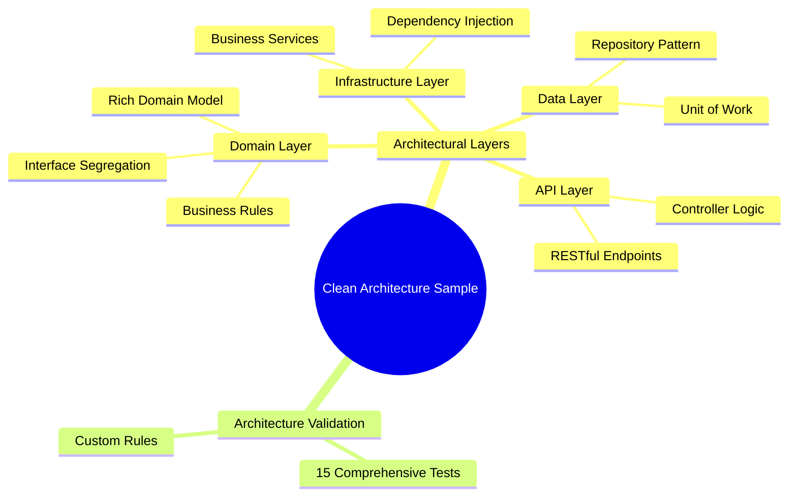

# Clean Architecture Sample with NetArchTest

A comprehensive .NET 9 sample demonstrating **Clean Architecture** principles with automated architectural validation using **NetArchTest**.

## Architecture Overview

This sample implements Clean Architecture with four distinct layers:

```
┌─────────────────────────────────────────┐
│                   API                   │  ← Controllers, Program.cs
├─────────────────────────────────────────┤
│              Infrastructure             │  ← Business Services
├─────────────────────────────────────────┤
│                  Data                   │  ← Repositories, UnitOfWork
├─────────────────────────────────────────┤
│                 Domain                  │  ← Entities, Interfaces
└─────────────────────────────────────────┘
```

### Dependency Flow
- **Domain**: No dependencies (core business logic)
- **Data**: Depends only on Domain (data access)
- **Infrastructure**: Depends only on Domain (business services)
- **API**: Depends on Domain interfaces only (presentation layer)

## Key Features



## Architecture Tests

The `NetArchTestSample.ArchitectureTests` project contains comprehensive tests that automatically validate:

### Dependency Rules
### Structural Rules
### Domain Rules


## Resources

- [Clean Architecture by Robert C. Martin](https://blog.cleancoder.com/uncle-bob/2012/08/13/the-clean-architecture.html)
- [NetArchTest Framework](https://github.com/BenMorris/NetArchTest)